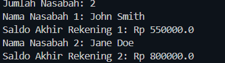

# Array-and-array-list

## Kelas dan Atribut yang ada

### 1. `Akun.java`
Atribut dan metode untuk mengelola saldo transaksi nasabah.
* **Atribut**: 
  * `balance` (`double`): Menyimpan saldo saat ini.
* **Metode**: 
  * `getBalance()`: Mengembalikan jumlah saldo.
  * `deposit(double amount)`: Menambahkan saldo jika jumlah positif.
  * `withdraw(double amount)`: Penarikan saldo jika saldo mencukupi.

### 2. `Nasabah.java`
Mengidentifikasi data nasabah dan daftar rekening yang dimilikinya.
* **Atribut**: 
  * `namaPertama` (`String`)
  * `namaAkhir` (`String`)
  * `akun` (`Akun[]`): Array statis berkapasitas 5.
  * `jumlahAkun` (`int`): Indeks/pelacak jumlah akun tersimpan.
* **Metode**: 
  * `getFirstName()`, `getLastName()`
  * `setAkun(Akun acct)`: Menambahkan objek akun baru ke dalam array.
  * `getAkun(int akunIndex)`: Mengambil objek akun berdasarkan indeks.
  * `getJumlahAkun()`: Mengembalikan jumlah akun yang dimiliki.

### 3. `Bank.java`
Mengelola seluruh nasabah yang terdaftar pada sistem perbankan.
* **Atribut**: 
  * `nasabah` (`Nasabah[]`): Array statis berkapasitas 10.
  * `jumlahNasabah` (`int`): Indeks/pelacak jumlah nasabah tersimpan.
* **Metode**: 
  * `addNasabah(String f, String l)`: Menambahkan nasabah baru.
  * `getJumlahNasabah()`: Mengembalikan total nasabah terdaftar.
  * `getNasabah(int index)`: Mengambil objek nasabah berdasarkan indeks.

### 4. `Main.java`
Kelas tempat dilakukannya eksekusi terhadap program yang menggunakan kelas-kelas sebelumnya

## Output Program ##
